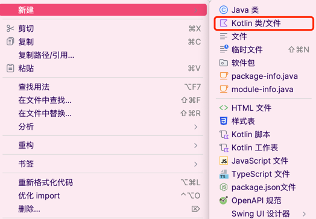
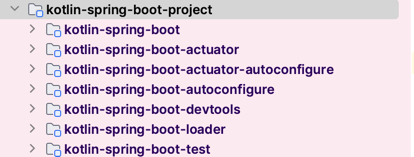
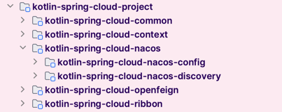

# 1.工程介绍

## 1.0 前置内容

本项目基于JDK11去进行编写, 采用Gradle版本为6.7(太高的Gradle版本会存在有兼容性问题).

## 1.1 开发背景

* 1.整个工程100%采用kotlin语言去进行编写, 了解安卓开发的小伙伴, 应该了解过这门语言, 被称为"安卓官方开发语言",
这门语言是由Jetbrains去进行开发的. 熟悉Intellij IDEA的小伙伴, 也许见过这门语言, 但是并未使用过.在新建一个Java类的地方, 有一个新建Kotlin类的地方! 而且Intellij
IDEA底层就是使用的 Kotlin去进行开发的.

* 2.Kotlin一度被很多程序员称为是最好的Java! 它几乎100%兼容Java, Kotlin上所引用的库, 很多都是来自于Java的库,
  因此在看Kotlin代码时,
  几乎是不会有什么大的困难, 因为绝大多数的类, 都是采用Java库当中的相关API, 作为Java程序员你会很熟悉,
  除了在Kotlin当中语法糖变得简洁了很多!
* 3.为什么采用Kotlin去进行开发? Kotlin是最好的Java! 既然Java能做的事情, 我用Kotlin也一定能做,
  我相信Kotlin一定会做的更好!
* 4.开启这个项目的目的在于方便于去学习spring当中的很多知识点, 很多知识点, 你不尝试去自己手写一个,
  你永远不知道底层为什么要怎么做!
* 5.项目当中添加了很多很多的中文的注释, 是作者对于该地方的理解(也许有不对的地方, 请谅解)!
* 6.因为时间有限, 项目当中存在很多很多的bug, 并未完成一个完整的测试工作.
* 7.对于项目的管理工具并未采用Maven, 而是采用比较新的Gradle, 并且是基于Kotlin版本的DSL去编写的构建脚本(
  网上你能找到的基本都是基于Groovy的DSL, 当然它们整体大差不差).
* 8.对于整个工程, 完全参考Spring原工程去进行实现, 对于使用方式也完全类似.

## 1.2 工程结构介绍

### 1.2.1 kotlin-spring-framework-project

这一部分主要实现spring-framework的部分, 主要包括下面的几个部分组成。

* kotlin-spring-core, Spring的核心依赖，主要是为Spring别的模块去提供相关工具类。
* kotlin-spring-beans, Spring当中关于Bean和BeanFactory的IOC核心实现。
* kotlin-spring-aop, Spring AOP的核心实现。
* kotlin-spring-context, Spring关于ApplicationContext实现的核心实现。
* kotlin-spring-instrument, 这个模块当中主要包含spring当中对于运行时编织的JavaAgent实现(
  比如AspectJ的LoadTimeWeave).
* kotlin-spring-web, 这个模块当中主要提供了基于Netty去仿照DispatcherServlet的实现, 实现SpringMVC相关的功能;
  以及一些关于Web客户端的相关支持.
* kotlin-spring-test, 这个模块当中主要用于spring整合JUnit4和JUnit5去为单元测试提供支持.
* kotlin-spring-jcl, 这个模块当中, 主要提供对于底层日志组件的桥接，用于为框架当中的日志输出选择合适的日志组件。

### 1.2.2 kotlin-spring-boot-project

这一部分主要实现spring-boot当中相关的模块, 比如自动装配、actuator监控、devtools热部署等.

* kotlin-spring-boot, 提供spring-boot的底层实现支持.
* kotlin-spring-boot-autoconfigure, 提供spring-boot的自动装配的支持,需要配合kotlin-spring-boot以及整个kotlin-spring-framework完成.
* kotlin-spring-boot-actuator, 提供spring-boot的监控的基础设施的endpoint相关的实现.
* kotlin-spring-boot-actuator-autoconfigure, 提供spring-boot-actuator的自动装配功能, 自动完成Endpoint的暴露.
* kotlin-spring-boot-devtools, 提供对spring-boot的热部署的实现的支持, 支持本地的热部署, 也支持基于文件的上传的方式去实现远程的热部署.
* kotlin-spring-boot-loader, 提供对于spring-boot的嵌入式Jar包的加载.
* kotlin-spring-boot-gradle-plugin, 提供对于spring-boot的Gradle打包插件.(待完成)
* kotlin-spring-boot-test, 整合kotlin-spring-test, 为spring-boot的测试实现提供支持.

### 1.2.3 kotlin-spring-cloud-project

这一部分主要提供spring-cloud相关功能的模块.

* kotlin-spring-cloud-common, spring-cloud的公共依赖.
* kotlin-spring-cloud-context, spring-cloud的context依赖, 提供spring配置文件的自动刷新等相关功能,
  为整个spring-cloud配置中心的实现提供支持.
* kotlin-spring-cloud-ribbon, 将ribbon客户端整合到spring-cloud当中, 使用的是ribbon的原生API去提供负载均衡.
* kotlin-spring-cloud-openfeign, 将openfeign客户端整合到spring-cloud当中, 使用的是原生的API, 并且支持负载均衡.
* kotlin-spring-cloud-nacos, 提供nacos作为注册中心和配置中心的实现.
    * kotlin-spring-cloud-nacos-config, 提供nacos作为配置中心的实现, 支持nacos远程配置文件的自动刷新.
    * kotlin-spring-cloud-nacos-discovery, 提供nacos作为注册中心的实现, 支持服务的自动注册,
      应用启动时会将服务暴露到nacos当中.

### 1.2.4 kotlin-spring-others

这一部分主要提供spring整合别的第三方的实现.

* kotlin-spring-shell, 基于spring去实现Shell命令行工具, 去处理相关命令.
* kotlin-spring-mybatis, 将mybatis整合到当前的spring工程当中, 提供DAO层的数据访问.
* kotlin-nacos, 基于spring-boot去实现mini的nacos(待完成).
    * kotlin-nacos-naming-server, 实现nacos的服务的注册与发现.
    * kotlin-nacos-config-server, 实现nacos的配置中心的相关功能.

### 1.2.5 kotlin-logger

主要实现自定义的日志组件, 整体设计参考Slf4j和Logback, 很多地方待完善, 目前并未完善.

* logger-api, 类似Slf4j的API的方式去定义Logger规范.
* logger-impl, 类似Logback的方式去实现日志组件(待完善).
* logger-slf4j-impl, 将自己的logger组件整合给Slf4j, 可以使用Slf4j的方式去使用到我们自定义的组件.

### 1.2.6 kotlin-metrics-project

这一部分主要实现关于Metrics监控指标的采集与暴露的实现(背景为Qunar的QMonitor).