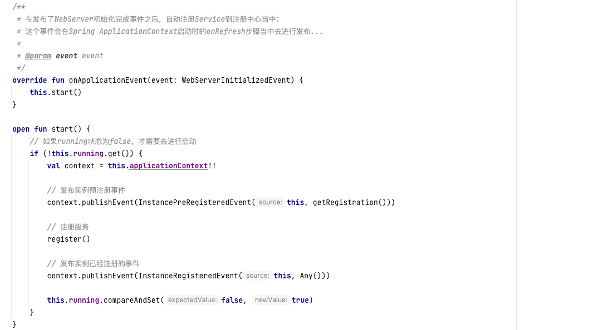
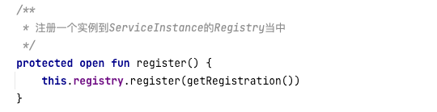
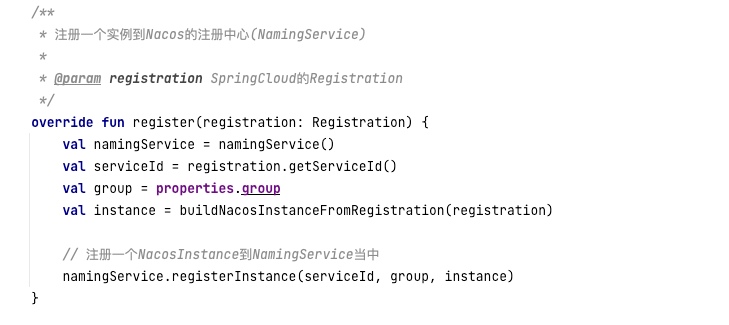
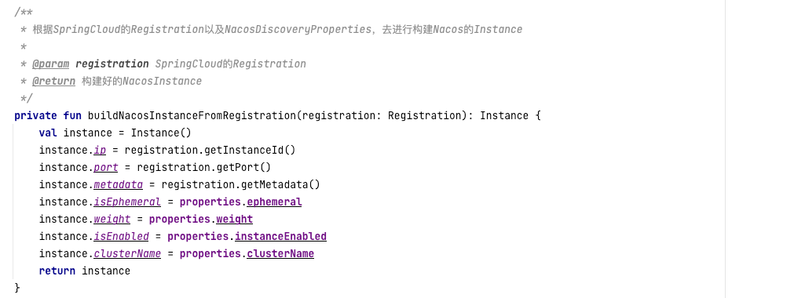

# 1. Nacos的服务自动注册与发现

## 1.1 Nacos如何实现服务的自动注册? 

在SpringCloud当中, 提供了服务自动注册的模板类`AbstractAutoServiceRegistration`, 这个类负责监听WebServerInitializedEvent事件, 并去自动处理服务的注册.

在Nacos当中的`NacosAutoServiceRegistration`实现了`AbstractAutoServiceRegistration`, 它组合了`NacosServiceRegistry`和`NacosRegistration`.

在注册实例的方法当中, `NacosServiceRegistry`便会自动将`NacosRegistration`去进行实例的注册.

## 1.2 Nacos怎么整合SpringCloud注册一个实例? 

Nacos的注册实例, 其实在`NacosServiceRegistry`的register方法当中

在`NacosServiceRegistry`的register方法当中, 会获取到Nacos的`NamingService`组件去进行服务的注册, 而`NamingService`就已经是来自于NacosClient的包当中了, 我们就不用往深层次的研究了.

构建一个Nacos实例的具体逻辑如下：

我们可以发现, 它进行服务注册时, 不仅用到了SpringCloud提供的`Registration`, 还用到了自定义的属性配置信息(因为SpringCloud默认的`Registration`当中的实例的信息, 不足以去往`NamingService`当中去注册一个实例), 
这些自定义属性(`NacosDiscoveryProperties`)的来源, 其实就是用户在配置文件当中去进行的配置, 将其绑定在一个JavaBean身上.